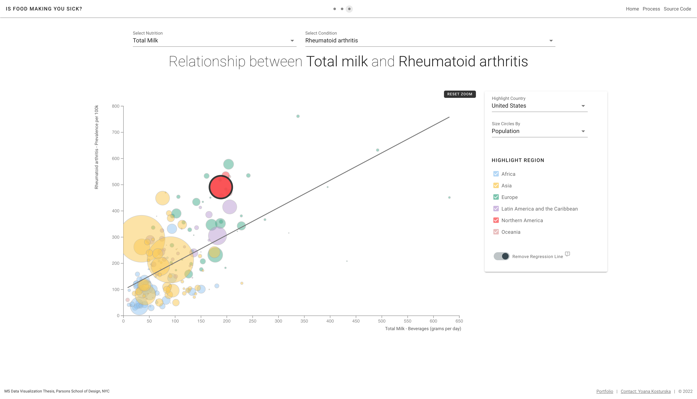

# Is Foor Making You Sick?
*Exploring the Relationship Between Nutrition and Health*

#### Technologies used:
**Data Visualization**: d3.js, underscore.js, JavaScript 
**Front-end**: Vue, Vuetify 
**Data Cleaning and Processing**: Python, Pandas, Matplotlib 
**Back-end**: Node.js, Express, MySQL
 
 
#### Project Links:
**Live Project**: [Is Foor Making You Sick?](https://yoanacodes.github.io/projects/thesis/)  
**Portfolio link with description**: [Is Foor Making You Sick?](https://yoanacodes.com/#/projects/thesis) 

#### About:
Is Food Making You Sick? is exploring the relationship between diet and health in 184 countries through the analysis and visualization of extensive data on nutritional factors and diseases. The project aims to study and visualize these relationships by juxtaposing 42 nutrients and 84 health conditions, allowing users to explore and analyze them.

Is Food Making You Sick? will answer questions such as do countries that have a high fat diet, also struggle with heart disease? Are countries in which people are consuming high amounts of sugar also overburdened with diabetes? and many others. By exploring the patterns between food consumption and health outcomes, users could better inform their dietary choices and be empowered by high quality, research data rather than speculative data that often float around the Internet. Exposing the data visually could also spark discussion amongst researchers about less researched correlations, setting the stage for testing hypotheses and performing additional studies.
 

#### App Screenshot:

